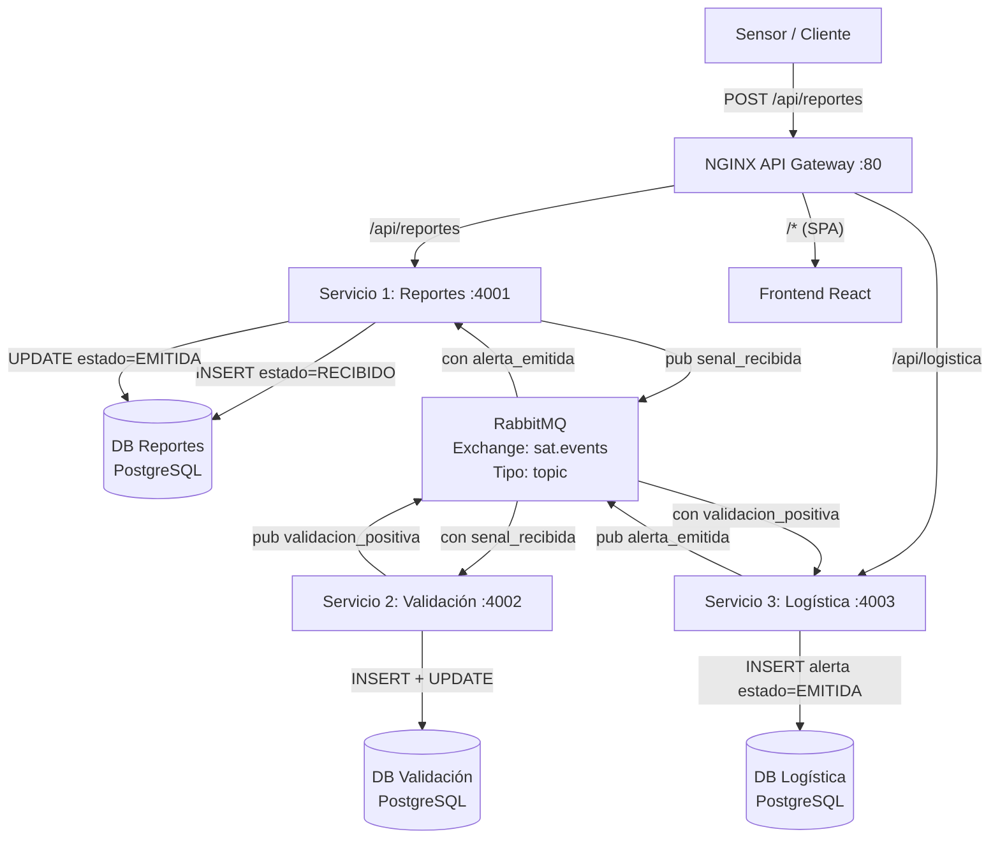

# SAT — Sistema de Alerta Temprana de Sismos

## Grupo 2

Arquitectura de microservicios para detección, validación y notificación de eventos sísmicos en tiempo real.
Comunicación síncrona (REST) para ingesta de reportes y asíncrona (RabbitMQ) para procesamiento interno.

---

## 1. Diagrama Arquitectónico



---

## 2. Contrato de Datos (Eventos RabbitMQ)

Todos los eventos viajan por el exchange `sat.events` (tipo `topic`).

### 2.1 Evento: `senal_recibida`

Publicado por el **Servicio 1: Reportes** al recibir una señal de un sensor.

```json
{
  "evento": "senal_recibida",
  "id_senal": "uuid-del-reporte",
  "timestamp": "2026-07-03T14:30:00Z",
  "id_sensor": "SENSOR-001",
  "ubicacion": {
    "lat": -33.456,
    "lon": -70.648
  },
  "magnitud": 4.2,
  "profundidad_km": 35,
  "confianza": 0.87
}
```

### 2.2 Evento: `validacion_positiva`

Publicado por el **Servicio 2: Validación** tras confirmar el sismo con múltiples sensores.

```json
{
  "evento": "validacion_positiva",
  "timestamp": "2026-07-03T14:30:02Z",
  "id_senal": "uuid-de-la-senal-original",
  "sensores_confirmados": ["SENSOR-001", "SENSOR-015", "SENSOR-032"],
  "magnitud_final": 4.3,
  "epicentro": {
    "lat": -33.458,
    "lon": -70.650
  }
}
```

### 2.3 Evento: `alerta_emitida`

Publicado por el **Servicio 3: Logística** al completar el registro y activar protocolos de emergencia.

```json
{
  "evento": "alerta_emitida",
  "timestamp": "2026-07-03T14:30:05Z",
  "id_validacion": "uuid-de-la-validacion",
  "nivel_alerta": "AMARILLO",
  "zonas_afectadas": ["Santiago Centro", "Providencia"],
  "costo_emergencia": 150000,
  "estado": "EMITIDA"
}
```

### Niveles de alerta

| Magnitud | Nivel | Costo emergencia |
|----------|-------|------------------|
| >= 6.0   | ROJO  | $1,500,000 CLP   |
| >= 4.0   | AMARILLO | $150,000 CLP  |
| < 4.0    | VERDE | $50,000 CLP      |

### Flujo completo del evento

```
Sensor -> POST /api/reportes -> Servicio 1 (Reportes)
  -> Guarda en DB + publica "senal_recibida" en RabbitMQ
    -> Servicio 2 (Validación) consume, cruza sensores, publica "validacion_positiva"
      -> Servicio 3 (Logística) consume, registra alerta, publica "alerta_emitida"
        -> Servicio 1 consume "alerta_emitida", actualiza estado a EMITIDA
```

---

## 3. Guía de Configuración de Acceso

### 3.1 Configurar archivo hosts

Agregar al archivo `/etc/hosts` de la máquina del evaluador:

```bash
# Linux / macOS
sudo nano /etc/hosts
```

Agregar:

```
146.83.102.21  qa.grupo2.uta.cl
146.83.102.21  prod.grupo2.uta.cl
```

### 3.2 Acceso a los servicios

| Entorno | URL |
|---------|-----|
| QA      | `http://qa.grupo2.uta.cl` |
| PROD    | `http://prod.grupo2.uta.cl` |

### 3.3 RabbitMQ Management UI

```bash
kubectl port-forward -n sat-qa svc/rabbitmq 15672:15672
# Abrir http://localhost:15672
# Usuario: sat-user / Contraseña: sat-pass
```

### 3.4 Kibana (logs centralizados)

```bash
kubectl port-forward -n sat-qa svc/kibana 5601:5601
# Abrir http://localhost:5601
```

---

## 4. Manual Operativo de Control

### 4.1 Verificar estado del sistema

```bash
# Todos los pods
kubectl get pods -n sat-qa

# Servicios
kubectl get svc -n sat-qa

# PVC (almacenamiento persistente)
kubectl get pvc -n sat-qa

# Ingress
kubectl get ingress -n sat-qa
```

### 4.2 Verificar logs en tiempo real

```bash
kubectl logs -n sat-qa deployment/reportes -f
kubectl logs -n sat-qa deployment/validacion -f
kubectl logs -n sat-qa deployment/logistica -f
kubectl logs -n sat-qa deployment/frontend -f
```

### 4.3 Enviar un sismo de prueba

```bash
curl -X POST http://qa.grupo2.uta.cl/api/reportes \
  -H "Content-Type: application/json" \
  -d '{
    "id_sensor": "DEMO-001",
    "timestamp": "2026-07-06T10:00:00Z",
    "ubicacion": {"lat": -33.45, "lon": -70.65},
    "magnitud": 4.5,
    "profundidad_km": 30,
    "confianza": 0.95
  }'
```

### 4.4 Verificar respaldos (CronJob cada 10 min)

```bash
# Ver CronJobs
kubectl get cronjob -n sat-qa

# Ver historial de ejecuciones
kubectl get jobs -n sat-qa

# Listar archivos de backup
kubectl exec -n sat-qa deployment/backup-dbs -- ls -la /backups/
```

### 4.5 Verificar mensajes en RabbitMQ

```bash
kubectl exec -n sat-qa deploy/rabbitmq -- rabbitmqctl list_queues name messages
```

### 4.6 Rollback de un deployment

```bash
kubectl rollout undo deployment/reportes -n sat-qa
kubectl rollout status deployment/reportes -n sat-qa
```

### 4.7 Datos en bases de datos

```bash
# Reportes
kubectl exec -n sat-qa db-reportes-0 -- psql -U reportes -d reportes -c "SELECT * FROM lecturas_sensores;"

# Logística
kubectl exec -n sat-qa db-logistica-0 -- psql -U logistica -d logistica -c "SELECT * FROM alertas;"
```

### 4.8 Recrear entorno

```bash
kubectl delete namespace sat-qa
kubectl apply -f kubernetes/namespace.yml
kubectl apply -f kubernetes/ --recursive -n sat-qa
```

---

## Arquitectura del Sistema

| Componente | Tecnología | Puerto |
|-----------|-----------|--------|
| Frontend | React + Nginx Alpine | 80 |
| API Gateway | Nginx Alpine | 80 |
| Servicio 1 - Reportes | Go | 4001 |
| Servicio 2 - Validación | Go + Gin | 4002 |
| Servicio 3 - Logística | Go + Gin | 4003 |
| DB Reportes | PostgreSQL 16 Alpine | 5432 |
| DB Validación | PostgreSQL 16 Alpine | 5432 |
| DB Logística | PostgreSQL 16 Alpine | 5432 |
| Message Broker | RabbitMQ 3.13 Alpine | 5672 |
| Logs | Fluent Bit -> Elasticsearch -> Kibana | - |

---

## CI/CD

| Rama | Entorno | Tag imagen |
|------|---------|-----------|
| `develop` | QA (`sat-qa`) | `qa-latest` |
| `main` | PROD (`sat-prod`) | `prod-latest` |

Despliegues completamente automáticos vía GitHub Actions. Prohibido el acceso manual a servidores.

---

## Estructura del Proyecto

```
SAT2/
├── .github/
│   ├── workflows/
│   │   ├── ci-qa.yml              # CI/CD: develop -> QA
│   │   └── ci-prod.yml            # CI/CD: main -> PROD
│   └── CODEOWNERS
├── backend/
│   ├── servicio-reportes/         # Centro de Reportes (REST + Eventos)
│   ├── servicio-validacion/       # Validación de Sensores (Event Driven)
│   └── servicio-logistica/        # Logística de Notificación (Event Driven)
├── frontend/                      # React + Vite + Tailwind
├── nginx/                         # API Gateway (Nginx Alpine)
├── kubernetes/                    # Manifiestos K8s
│   ├── namespace.yml
│   ├── configmap.yml
│   ├── secret.yml
│   ├── ingress.yml
│   ├── backup-cronjob.yml
│   ├── rabbitmq/
│   ├── postgresql/
│   ├── servicios/
│   ├── frontend/
│   ├── nginx-gateway/
│   └── logging/
├── docker-compose.yml             # Entorno local de desarrollo
├── guia-despliegue.md             # Guía completa de despliegue en VMs
├── guia-despliegue.txt
├── AGENTS.md                      # Documentación para agentes de desarrollo
└── README.md
```
